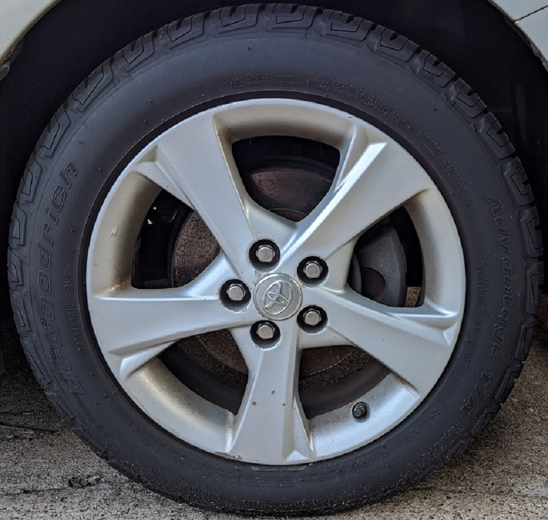
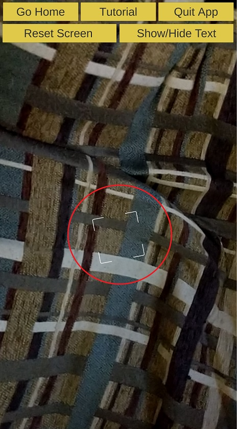

# AR tool for Engineering Education
In this project, to aid in the ongoing development and experimentation of use of AR in education, an AR based tool was developed. The tool is able to in-tegrate 3D models used in engineering education, mainly electronics and mechanical and allow students to view them in the context of real environment. The project will contribute in the field of educational AR apps by developing a new app as a supplemental tool for improving teaching. The current scope of the project will develop a prototype with limited opensource 3D models, interaction abilities, teaching content and quiz feature. 

## Project Overview
This project will develop an Augmented Reality mobile application to improve quality of teaching in engineering education. (While this project focus on using 3D models for engineering topics, the models can be for any education topic.) The app will display the models required to be taught in engineering courses in 3D interface. The students will be able to interact with the model using touch inter-face to rotate, translate and scale. For each model, a help menu will be provided on how to interact with it. Each model will also have a hotspot point on it where students can touch to find more information about that component. In addition, there will be a quiz mode where questions about the model will be asked to ac-cess student knowledge. 
### Main features 
The main features of the project can be listed as follows:
1. Develop an augmented reality mobile app based on Android OS
2. Integrate various 3D models used in engineering education in the app
3. Implement object detection to combine virtual model with real environ-ment (E.g. Engine in a car)
4. Allow students to engage with the model with interactions such as rota-tion, scaling, translating etc. using touch and device orientation input
5. Provide help, tutorial, demo modes to help students use the tool
6. Provide hotspots on the model to get more information about the part of the model and overall information about the model
7. Provide at least two types quiz based on the models to access student learning:
   1. Multiple choice quiz on the overall model displayed
   2. Multiple choice quiz to identify part/points of the model
   3. Track the scores and provide feedback to students
8. Integrate 3D models with more than one component: 
   1. Allow students to interact each component separately
   2. Also have a mode to see how different components combine to-gether to form a larger model
   3. Allow students to view and interact with the components com-bined

## System Requirements

- **Minimum SDK Required**: Android 10.0 or higher 

## Installation 

**Install using APK**

1. Copy `.apk` file from the `/apk` directory to an Andorid phone.
2. Open the copied `.apk` file in the phone and allow it be installed.
	
## Using the app

- If you are interested in using the app, you can download and test the apk in Android mobile device of version 10. Please note that for the marker-based object detection (Model on object) the mobile camera needs to focus on the images in the following link (car image for car engine and tire image for tire model) that can be found in ```/Pictures``` folder or link [here](https://gtvault-my.sharepoint.com/:f:/g/personal/mshrestha6_gatech_edu/EtDA-fmSCBdDiK6TRp_h55EB4LkIT1eseg2l_UE0Yhraag)

i) Car image for car engine model projection | ii)Tire image for tire model projection
---------------------------------------------|-----------------------------------------
 | 


- For the marker-less object detection (Model on ground), you need to point the mobile camera to the ground and trace the white square bracket as shown in the figure below (marked with the red circle in the picture) and click on it to see the virtual 3D model of car engine.

<div align="center">

<p><sup>Figure 1— White square to track the ground plane on which the virtual 3D model is projected in the marker-less button in the app.</sup></p>
</div>


##### Note: Please refer the usertutorial in ```/Docs``` folder for using the app.
