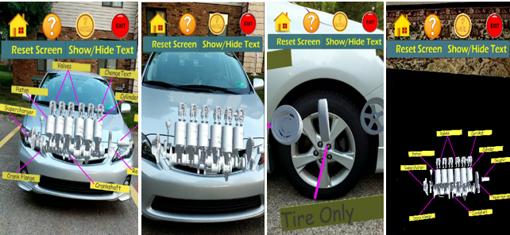

# AR app for Engineering Education
In this project, to aid in the ongoing development and experimentation of use of AR in education, an AR based tool was developed. The tool is able to integrate 3D models used in engineering education, mainly electronics and mechanical and allow students to view them in the context of real environment. The project will contribute in the field of educational AR apps by developing a new app as a supplemental tool for improving teaching. Currently, a prototype with limited opensource 3D models, interaction abilities, teaching content and quiz feature is developed. using Unity and Vuforia.

## Project Overview
This work presents an Augmented Reality mobile application developed to be implemented by engineering instructors to improve quality of teaching in engineering
education. The app displays the models required to be taught in engineering courses in 3D interface and allow students to interact with them. The app contains quiz which can be used by students to assess their learning in the app itself. 

### Main features

The main features of the app can be listed as follows:

#### 1. AR based learning

Using 3D virtual model on real environments objects to learn baisc parts of engineering models here car engine model and tire used. 


<sup>Figure 2— Screenshots for (A) Car engine model on real car, (B) Car engine model on real car with text hidden, (C) Multiple parts of tire on real tire (D) Car engine model on ground surface </sup>

 #### 2. Quiz based learning
 
Text and 3D model based multiple choice quizzes to access the student's knowledge.


<sup>Figure 3— Screenshots for (A) Simple quiz with text, (B)Simple quiz with picture, (C) Interactive quiz, (D) Review page.</sup>

## System Requirements

- **Minimum SDK Required**: Android 10.0 or higher 

## Installation 

**Install using APK**

1. Copy `.apk` file from the `/apk` directory to an Andorid phone.
2. Open the copied `.apk` file in the phone and allow it be installed.
	
## Using the app

- If you are interested in testing the app, you can download and test the apk in Android mobile device of version 10. 
   - For projecting the 3D models using the *marker-based object detection (Model on object)*, the mobile camera needs to focus on the following images (car image for car engine and tire image for tire model) that can be deownloaded from ```/Pictures``` folder or from this [link](https://gtvault-my.sharepoint.com/:f:/g/personal/mshrestha6_gatech_edu/EtDA-fmSCBdDiK6TRp_h55EB4LkIT1eseg2l_UE0Yhraag)

i) Car image for car engine model projection | ii)Tire image for tire model projection
---------------------------------------------|-----------------------------------------
 | 


  - For projecting the 3D models on ground uisng marker-less object detection/*ground plane detection (Model on ground)*, you need to point the mobile camera to the ground and trace the white square bracket as shown in the figure below (marked with the red circle in the picture) and click on it to see the virtual 3D model of car engine.

<div align="center">

<p><sup>Figure 1— White square to track the ground plane on which the virtual 3D model is projected in the marker-less button in the app.</sup></p>
</div>


##### Note: Please refer the usertutorial in ```/Docs``` folder for using the app.
